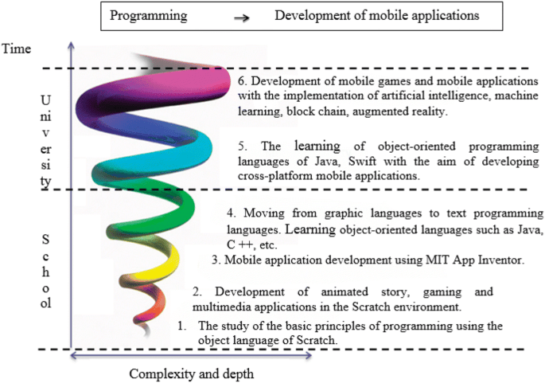

The teaching approach in which each subject or skill area is revisited at intervals, at a more sophisticated level each time. First, there is basic knowledge of a subject, then more sophistication is added, reinforcing principles that were first discussed.

[Bruner](jerome-bruner.md) also believes learning should be spurred by interest in the material rather than tests or punishment, since one learns best when one finds the acquired knowledge appealing.

## Related

- [Jerome Bruner](jerome-bruner.md)

