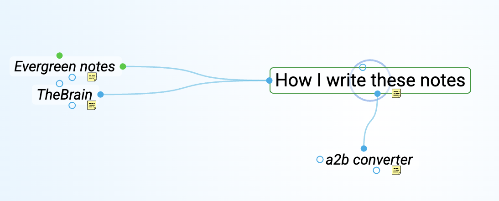

(historical: I started writing all notes in plain .org format using old trusty Emacs. This was good for 10 notes, it's awful for 100 notes).

I'm writing this note (and most of the notes on this site) using [TheBrain](thebrain.md). This allows me to have the controlled overview of the linked notes. This also means that I have to publish it with custom exporter, which I do.

You can see that links for [a2b converter](a2b_converter.md) and [TheBrain](thebrain.md) and [Evergreen notes](evergreen-notes.md) are shown (semi)automatically — for most of then I have to right click on plain text and choose "link NodeName".

## Related

- [TheBrain](thebrain.md)
- [a2b converter](a2b_converter.md)

