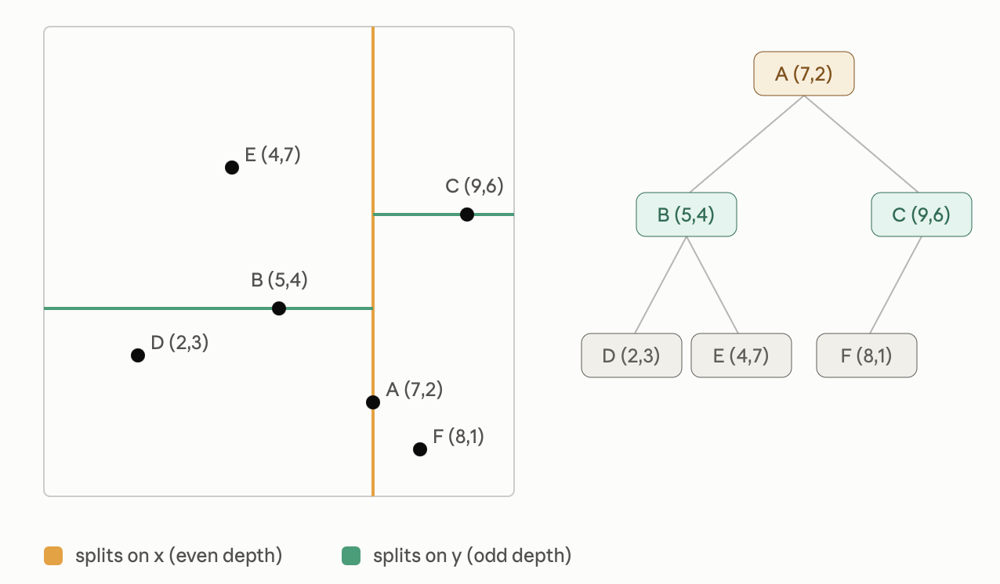

A k-d tree (k-dimensional tree) is a [binary search tree](binary-search-tree.md) for points in k-dimensional space. It generalizes the BST idea: instead of comparing whole keys, each level of the tree compares points along **one axis**, cycling through axes as you descend.


```test
Q: How does a k-d tree generalize the BST comparison?
A: Instead of comparing whole keys, each level compares points along one axis, cycling through axes as you descend.
```
