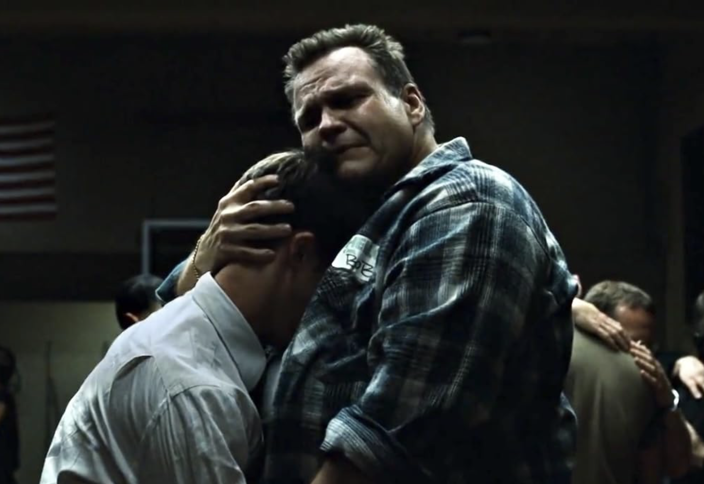

I was very surprised when knew that one of the key roles in Fight Club movie was played by Meat Loaf: he played "Man with titties" Robert "Bob" Paulson. 

You perhaps remember the frame where he hugs The Narrator:

Crazy. This is the "I'd Do Anything for Love (But I Won't Do That)" Meat Loaf. The power ballad tearjerker guy. The "Bat out of Hell I-II-III" Meat Loaf. "Get overweight to not go Vietnam" Meat Loaf.

Somehow I was not prepared and can't even articulate the reason.

"His name is Robert Paulson"
