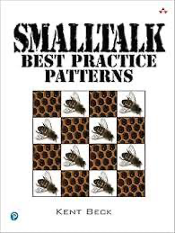

## Related

- ["Overall, the goal of breaking your program into methods is to communicate your…](overall-the-goal-of-breaking-your-program-into-methods-is.md)
- ["Divide your program into methods that perform one identifiable task. Keep all…](divide-your-program-into-methods-that-perform-one.md)
- [Kent Beck](kent-beck.md)

