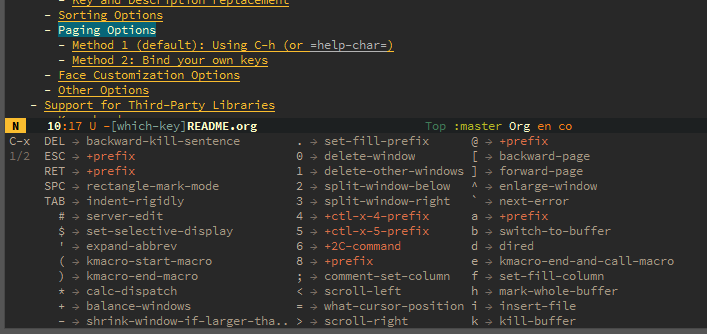

At some point Emacs control scheme using key sequences to run exact command became so complex to navigate, that `which-key`  appeared, became popular, and was included in the official Emacs package starting with version 30. Its main function is to help user to see what choices they can make at current state of input. On picture below user pressed `C-x` , waited a second in awe, and is being presented with a popup and a set of possible commands:

_{}_

So now they can e.g. press `DEL`  without internal fear that it is does something different than `backward-kill-sentence` . 

This approach works very well for me (and not only me —it was included into official Emacs package for a reason!), but some  [like a different approach more](https://www.matem.unam.mx/~omar/apropos-emacs.html#the-case-against-which-key-a-polemic). I'll call it `embark`  or `kakoune`  approach: you need to present a scope for a command (e.g. a previous sentence) and family of commands (e.g. deletion), and then computer will decide what existing command to run to achieve requested result. 

It reminded me one of key distinction between old-school language like FORTH and modern stuff like Python or Ruby; `+` in FORTH means `add two last numbers on stack and put sum back on stack`. `+` in Python means whatever you make it support, e.g. `concatenate strings` or \`merge objects\`. 

FORTH requests a strict name for each action, Python is chilling and let you make your general terms that mean too much or nothing at all:  `dwim` is one of examples. Thus `which-key` (and previous state of controlling Emacs with the keyboard) is isomorphic to FORTH; and `embark`  is our new reality of [Do What I Mean.](do-what-i-mean.md)

## Related

- [Do What I Mean](do-what-i-mean.md)
- [Recall vs Recognition](recall-vs-recognition.md)

